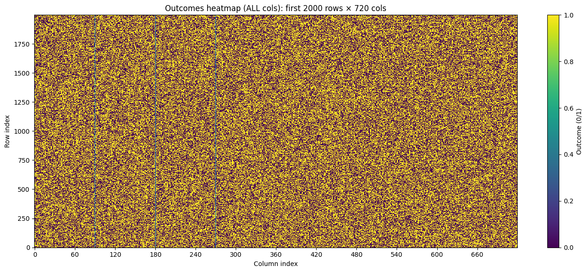

# Heatmap of Universe

What if the universe is *perfectly deterministic* - not “spooky”, not “telepathic”, just an unimaginably large ledger of binary outcomes - and what we call “Bell correlations” are simply what you get when you score only the outcomes you actually asked the universe to reveal?

This repo is a playful, technical sandbox that builds exactly that: a **binary heatmap of the universe** allowing you to query such a ledger and observe Bell-like correlations.

It’s educational first, provocative second, and definitely not a claim about what nature *must* be doing.

---

## How to use

### 1) Clone + create a virtualenv

```bash
git clone <your-repo-url>
cd heatmap-of-universe

python -m venv .venv
source .venv/bin/activate
python -m pip install -U pip
pip install -r requirements.txt
```

### 2) Run the simulation

```bash
python grand_ledger_of_reality.py
```

The script will output pairwise match rates for different angle separations, showing how the correlations emerge from the deterministic ledger when you only look at the measured pairs.

## What you get

- A huge binary matrix **X**: the “Universe Ledger”
  - shape `(n_rows, n_cols)`
  - entries in `{0,1}` (think: electron/positron, pass/fail, +1/-1 — you choose the interpretation)
  - constructed to keep **whole rows ~50/50** and **whole columns ~50/50**

- A binary matrix **M**: the “Measurement Mask”
  - same shape
  - exactly **two 1s per row** (two settings queried per trial)
  - everything else is “not asked, not observed”

- A Bell-like evaluation:
  - per trial, pick a pair of settings `(i, j)`
  - overwrite `X[row, i]` and `X[row, j]` so that:
    - each marginal stays 50/50
    - match probability becomes `cos²(Δ)` where `Δ` is the angle difference between the two settings
  - compute match rates **only on rows where that pair was measured** (the mask decides what counts)

Then: **heatmaps**, because if you’re going to claim you’ve got a universe ledger, you might as well look at it.

---

## The narrative

### 1) The Universe Ledger (X)



Imagine the universe contains a gigantic deterministic answer sheet:

- every possible “setting” corresponds to a **column**
- every “trial” corresponds to a **row**
- each cell is a definite binary outcome: `0` or `1`

We start by filling the ledger with unbiased randomness, which gives us the comforting property:

- each row has ~half ones
- each column has ~half ones

So: **the ledger is globally fair** (50/50) no matter how you slice it.

### 2) The Measurement Mask (M)
In Bell-type experiments you don’t query the entire universe ledger.

You query **two settings**, per trial.

That means the dataset is not “a full table of outcomes for all settings”.
It’s a sparse set of revealed entries.

So we store a mask **M**:

- `M[row, col] = 1` means “this cell was actually measured”
- otherwise the cell is irrelevant to scoring

### 3) The cos² rule (what we enforce)
When a row chooses the measured pair `(i, j)` we impose:

- `P(X[row,i] = 1) = 0.5`
- `P(X[row,j] = 1) = 0.5`
- `P(X[row,i] == X[row,j]) = cos²(Δ)`

This is done without any “signals” in the code — we just generate the two bits in a correlated way for that chosen pair.

That’s the point of the sandbox:
**it separates “the giant table exists” from “what you decided to score.”**

---

## What “columns” represent

Columns are indices `0..n_cols-1`.

We interpret them as angles on `[0°, 180°]` by mapping each column index to a degree value:

```python
col_settings = np.linspace(0.0, 180.0, n_cols)
```

So the angular step per column is:

```text
step_deg = 180 / (n_cols - 1)
```

When you request angles like `0°, 45°, 90°, 180°`, we convert them to the nearest column indices:

```python
idx = round((deg / 180) * (n_cols - 1))
```

…and print both:
- the chosen indices
- the actual degrees represented after rounding

This repo demonstrates it for:
- `n_cols = 20` (coarse)
- `n_cols = 360` (fine-ish)
- `n_cols = 720` (finer)
